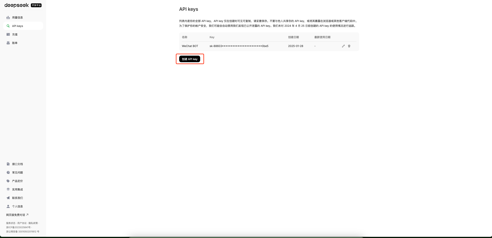
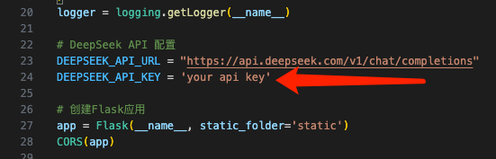

# deepseek_project
# Installation

## 第一步：安装依赖
```shell
pip install -r requirements.txt
```

▎WeChat Assistant Project

project: wechat_project

项目描述

通过对接DeepSeek API与微信接口实现的智能聊天机器人，支持自动化消息响应。
Description: A WeChat chatbot integrated with DeepSeek's API for automated message replies.

核心功能

微信消息实时监听
DeepSeek多轮对话接口调用
上下文敏感型回复生成
异常流量熔断机制

▎Document Upload Assistant

project: Document_upload_assistant

背景说明

为解决DeepSeek平台未开放文件上传API的技术限制，开发的本地化文件处理解决方案。
Background: Localized file processing solution addressing DeepSeek's lack of file upload API.

▎Deepseek_r1_deploy

project: deepseek_r1_deploy

项目描述:快速使用魔搭社区部署deepseek蒸馏模型，服务器本地都可以运行，包含前端界面
Quickly deploy Deepseek distillation model using the Magic Community, which can run locally on the server and includes a front-end interface

## 第二步：获取API Key

登陆[DeepSeek开放平台](https://platform.deepseek.com/)创建API Key，将API Key粘贴到bot.py下第24行。





## 第三步：运行bot.py

运行bot.py，扫描命令行中的二维码登陆微信账号，等待弹出控制面板。
